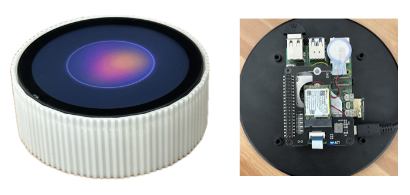
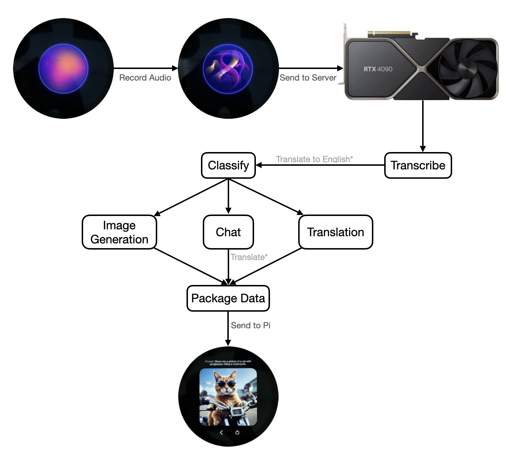

# CS431 Pi-LLM

## Introduction
This is the code for a Raspberry Pi-based personal assistant. It uses open source libraries to perform tasks such as voice recognition, translation, image generation, and conversation.  
**This project is mostly an excuse to mess with open source models and test them.**  

A full report describing the system, design decisions, and limitations is available in [`Report/report.pdf`](Report/report.pdf).

---

## 🖥️ Server

- [x] Flask server: `server_main.py`
- [x] Chat model and classifier: `chat_model.py`
- [x] Image generation: `image_gen.py`
- [x] Translation: `translator.py`
- [x] Transcription: `whisper_speech.py`
- [ ] Text-to-speech: `speech_transcribe.py`

## 📱 Client

- [x] Recorder: `audio.py`
- [x] Client-server interaction: `client.py`
- [x] GUI: `main_new.py`
- [ ] NFC emulation: `nfctest.py`, `cli.py`, `beam.py`

---

## 🧪 What Needs Work

- [ ] Improve prompt recognition & classification  
  (`classifier.txt`, `chat_model.py` – fails hilariously sometimes, maybe switch to Llama3?)
- [ ] Text-to-speech (maybe Meta MBART or bark)
- [ ] NFC emulation launches Apple Pay instead of opening a URL (likely PN532 issue)

---

## 💡 Future Ideas (If I Ever Revisit)

- Use a **multimodal model** instead of separate subsystems  
- Replace local models with **OpenAI GPT-style API calls** for modularity  
- Try running on more powerful SBCs or edge GPUs

---

## 📦 Status

This project is archived. I don’t have time to maintain or improve it at the moment.  
That said, feel free to fork, repurpose, or build on it — MIT licensed.
